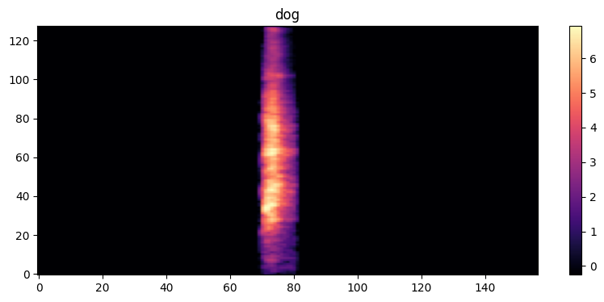

# Environmental Sound Classification Using Deep Learning



---

## **Project Overview**

This project implements a **deep learning model for environmental sound classification** using a custom **Residual Convolutional Neural Network (Residual CNN)**. The model is trained on the **ESC-50 dataset**, which contains 2,000 labeled audio recordings across **50 environmental sound categories**.

The objective of this project is to classify short audio clips into their correct sound category by learning meaningful audio features from **Mel Spectrograms**.

The model can recognize sounds such as:

- Dog Bark
- Rain
- Fire
- Clock Tick
- Keyboard Typing
- Clapping
- Whistling
- Helicopter
- Thunderstorm
- Chainsaw
- And many more.

This project demonstrates the complete **deep learning workflow for audio classification**, including preprocessing, feature extraction, model training, evaluation, and model export.

---

## **Technologies and Libraries**

- **Python 3.10+**
- **TensorFlow / Keras** – Deep Learning framework
- **Librosa** – Audio processing and feature extraction
- **NumPy** – Numerical computations
- **Pandas** – Dataset handling
- **Matplotlib** – Data visualization
- **Scikit-learn** – Label encoding and evaluation metrics

---

## **Dataset**

The project uses the **ESC-50 Dataset**, a benchmark dataset for environmental sound classification.

Dataset statistics:

- **2,000 audio recordings**
- **50 environmental sound classes**
- **40 audio samples per class**
- **5-second audio clips**
- **Official 5-fold dataset split**

Dataset Link:

https://github.com/karolpiczak/ESC-50

---

## **Audio Preprocessing**

Each audio file is processed before being used for training.

The preprocessing pipeline includes:

1. Load the audio file using **Librosa**
2. Resample audio to **16 kHz**
3. Generate a **Mel Spectrogram**
4. Convert the spectrogram to **Decibel (dB)**
5. Apply **Z-score normalization**
6. Add a channel dimension for CNN input

### **Feature Extraction Parameters**

| Parameter | Value |
|------------|-------|
| Sample Rate | 16,000 Hz |
| Mel Bands | 128 |
| FFT Size | 2048 |
| Hop Length | 512 |

Final input shape:

```
128 × 157 × 1
```

---

## **Dataset Split**

The model follows the official ESC-50 fold structure.

- **Training Set:** Fold 1, Fold 2, Fold 3
- **Validation Set:** Fold 4
- **Testing Set:** Fold 5

Using the official folds provides a fair and standardized evaluation.

---

## **Model Architecture**

The model is a custom **Residual Convolutional Neural Network (Residual CNN)** designed for environmental sound classification.

Architecture:

1. Input Layer
2. Convolution Block (32 Filters)
3. Residual Block (64 Filters)
4. Max Pooling
5. Residual Block (128 Filters)
6. Max Pooling
7. Residual Block (256 Filters)
8. Max Pooling
9. Global Average Pooling
10. Dense Layer (256 Units, ReLU)
11. Dropout Layers
12. Output Layer (50 Units, Softmax)

### **Why Residual CNN?**

- Learns complex audio patterns from spectrograms
- Residual connections improve training stability
- Reduces the vanishing gradient problem
- Lightweight compared to large pretrained image models
- Well suited for environmental sound classification

---

## **Training Details**

- **Feature Extraction:** Mel Spectrograms
- **Normalization:** Z-score Standardization
- **Loss Function:** Categorical Crossentropy (with Label Smoothing)
- **Optimizer:** AdamW
- **Learning Rate:** 3e-4
- **Batch Size:** 32
- **Epochs:** 50

### **Training Callbacks**

- EarlyStopping
- ReduceLROnPlateau
- ModelCheckpoint

These callbacks improve training stability and automatically save the best-performing model.

---

## **Performance**

| Metric | Value |
|--------|-------|
| Training Accuracy | 86.5% |
| Best Validation Accuracy | 74.5% |
| Number of Classes | 50 |

### **Evaluation**

The trained model was evaluated using:

- Test Accuracy
- Confusion Matrix
- Classification Report

These metrics provide a detailed evaluation of the model's performance across all sound categories.

---

## **Saved Model**

The best-performing model is automatically saved during training using **ModelCheckpoint**.

The final trained model is exported as:

```
esc50_sound_classifier.keras
```

This allows the model to be loaded later for inference or additional experiments without retraining.

---

## **Prediction Pipeline**

```
Audio File
      │
      ▼
Load Audio
      │
      ▼
Generate Mel Spectrogram
      │
      ▼
Normalize Features
      │
      ▼
Residual CNN
      │
      ▼
Softmax Layer
      │
      ▼
Predicted Sound Class
```

---

## **Project Structure**

```
Environmental-Sound-Classification/
│
├── assets/
│   └── mel_spectrogram.png
│
├── notebook/
│   └── training.ipynb
│
├── model/
│   └── esc50_sound_classifier.keras
│
├── README.md
└── requirements.txt
```

---

## **Future Improvements**

- Apply audio data augmentation (Noise Injection, Time Shift, Pitch Shift)
- Implement SpecAugment for improved generalization
- Use MixUp augmentation during training
- Perform full 5-fold cross-validation
- Experiment with deeper CNN architectures
- Compare different audio feature extraction techniques such as MFCCs and Chroma features
- Improve classification accuracy on challenging sound classes

---

## **Applications**

Environmental sound classification has many practical applications, including:

- Smart Home Systems
- Environmental Monitoring
- Wildlife Sound Recognition
- Urban Noise Analysis
- Security and Surveillance
- Audio Event Detection
- Intelligent Sensing Systems

---

## **Results**

This project successfully demonstrates an end-to-end deep learning pipeline for environmental sound classification. Starting from raw audio files, the project extracts Mel Spectrogram features, trains a custom Residual CNN, evaluates its performance using multiple metrics, and exports the best-performing model for future use.

The final model achieved:

- **Training Accuracy:** 86.5%
- **Best Validation Accuracy:** 74.5%

These results demonstrate that deep learning combined with Mel Spectrogram feature extraction is an effective approach for environmental sound classification.
